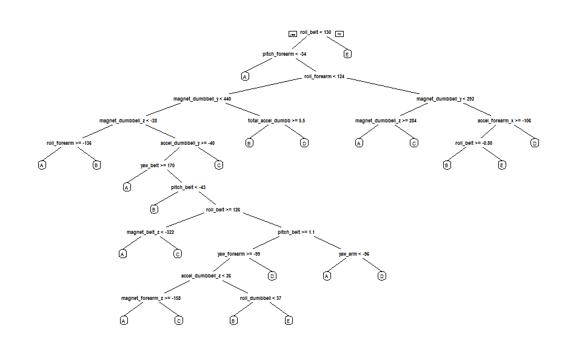
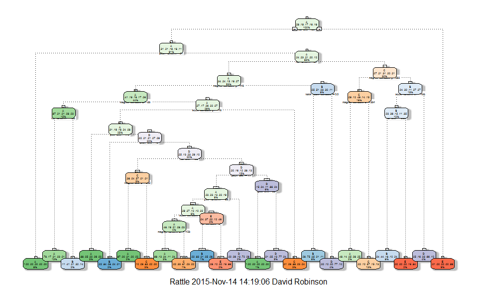

Practical Machine Learning Course Project
=========================================
## Executive Summary
Using devices such as Jawbone Up, Nike FuelBand, and Fitbit it is now possible to collect a large amount of data about personal activity relatively inexpensively.  In this project I will use personal activity training and testing data from the source http://groupware.les.inf.puc-rio.br/har to develop a machine learning prediction model related to weight training.  The data is derived from accelerometers on the belt, forearm, arm, and dumbell for each of six participants who were asked to perform barbell lifts correctly and incorrectly in five different ways.  My goal in this project is to develp a machine learning algorithm to accurately predict the way in which they did the exercise (sitting-down, standing-up, standing, walking, and sitting), which is reflected by the "classe" variable in the training data set.  I will describe how I built the model, how I used cross validation to estimate the expected out-of-sample error, and why I made the choices I did.  I will also use my prediction model to predict 20 different test cases.  In the end, I will decide to use a Random Forest machine learning algorithm to predict activity quality from activity monitors with 99.2% accuracy, with a corresponding cross-validated out-of-sample error rate estimate of 0.8%.

## Prepare to Analyze Data
First we load reqired packages and prepare to analyze the data.

```r
library(caret)
```

```
## Loading required package: lattice
## Loading required package: ggplot2
```

```r
library(rpart)
library(rpart.plot)
library(randomForest)
```

```
## randomForest 4.6-12
## Type rfNews() to see new features/changes/bug fixes.
```

```r
library(rattle)
```

```
## Rattle: A free graphical interface for data mining with R.
## Version 4.0.0 Copyright (c) 2006-2015 Togaware Pty Ltd.
## Type 'rattle()' to shake, rattle, and roll your data.
```

```r
library(knitr)
set.seed(101)
```

## Read the Data
Next we read the training and testing data sets, and convert all missing values to "NA."

```r
training_data <- read.csv("pml-training.csv", 
                          na.strings = c("NA", "#DIV/0!", ""))
testing_data <- read.csv("pml-testing.csv",
                         na.strings = c("NA", "#DIV/0!", ""))
```

## Explore the Data
Then we determine the dimensions (number of rows and columns) of the training and testing data sets.

```r
dim(training_data)
```

```
## [1] 19622   160
```

```r
dim(testing_data)
```

```
## [1]  20 160
```

## Clean the Data
Next we clean the data to remove columns that do not contain accelerometer data, in addition to columns with missing values, and look at the cleaned data frame dimensions.

```r
training_data_minus <- training_data[-c(1:7)]
cleaned_training_data <- training_data_minus[ , colSums(is.na(training_data_minus)) == 0]
dim(cleaned_training_data)
```

```
## [1] 19622    53
```

```r
testing_data_minus <- testing_data[-c(1:7)]
cleaned_testing_data <- testing_data_minus[ , colSums(is.na(testing_data_minus)) == 0]
dim(cleaned_testing_data)
```

```
## [1] 20 53
```

## Partition the Data
Then we partition the training data set into a 60:40 subset (training:testing) for the purpose of training and testing our selected machine learning algorithms.

```r
inTrain <- createDataPartition(y = cleaned_training_data$classe, p = 0.6, list = FALSE)
training <- cleaned_training_data[inTrain, ]
testing <- cleaned_training_data[-inTrain, ]
```

## Develop a Machine Learning Algorithm and Cross-validate to Estimate the Out-of-sample Error
Now we develop a machine learning algorithm to predict activity quality from activity monitors, and subsequently cross-validate the results to estimate the out-of-sample error rate.  First, we will build a classification and regression trees (CART) model using a Recursive Partitioning and Regression Trees machine learning algorithm.  Then we will build a Random Forest machine learning algorithm, and compare it with the CART model for accuracy.

### 1. CART Prediction Model using Recursive Partioning and Regression Trees
First we create a classification tree machine learing algorithm using Recursive Partitioning and Regression Trees, and plot the results.

```r
class_tree <- rpart(classe ~ ., data = training, method = "class")
prp(class_tree, cex = 0.5)
```

 

```r
fancyRpartPlot(class_tree, cex = 0.3)
```

 

Next we cross-validate the results to estimate the out-of-sample error rate.

```r
predict_class_tree <- predict(class_tree, testing, type = "class")
confusionMatrix(predict_class_tree, testing$classe)
```

```
## Confusion Matrix and Statistics
## 
##           Reference
## Prediction    A    B    C    D    E
##          A 2069  262   35  100   53
##          B   73  910  116  126  289
##          C   48  185 1117  184  156
##          D   29  135  100  816   92
##          E   13   26    0   60  852
## 
## Overall Statistics
##                                           
##                Accuracy : 0.7346          
##                  95% CI : (0.7247, 0.7444)
##     No Information Rate : 0.2845          
##     P-Value [Acc > NIR] : < 2.2e-16       
##                                           
##                   Kappa : 0.6628          
##  Mcnemar's Test P-Value : < 2.2e-16       
## 
## Statistics by Class:
## 
##                      Class: A Class: B Class: C Class: D Class: E
## Sensitivity            0.9270   0.5995   0.8165   0.6345   0.5908
## Specificity            0.9198   0.9046   0.9115   0.9457   0.9845
## Pos Pred Value         0.8214   0.6011   0.6609   0.6962   0.8959
## Neg Pred Value         0.9694   0.9040   0.9592   0.9296   0.9144
## Prevalence             0.2845   0.1935   0.1744   0.1639   0.1838
## Detection Rate         0.2637   0.1160   0.1424   0.1040   0.1086
## Detection Prevalence   0.3211   0.1930   0.2154   0.1494   0.1212
## Balanced Accuracy      0.9234   0.7520   0.8640   0.7901   0.7877
```
As you can see in the "Overall Statistics" section of the above Confusion Matrix, the estimated accuracy for the classification tree prediction model is 73.5% (with a statistically significant P-Value), resulting in a corresponding out-of-sample error rate estimate of 26.5% (1 - accuracy estimate).

### 2. Random Forest Prediction Model
Next we create a Random Forest machine learning algorithm to predict activity quality from activity monitors, and print the results.

```r
modFit_RF <- randomForest(classe ~ ., data = training)
modFit_RF
```

```
## 
## Call:
##  randomForest(formula = classe ~ ., data = training) 
##                Type of random forest: classification
##                      Number of trees: 500
## No. of variables tried at each split: 7
## 
##         OOB estimate of  error rate: 0.58%
## Confusion matrix:
##      A    B    C    D    E  class.error
## A 3345    2    0    0    1 0.0008960573
## B   19 2255    5    0    0 0.0105309346
## C    0   10 2043    1    0 0.0053554041
## D    0    0   19 1908    3 0.0113989637
## E    0    0    2    6 2157 0.0036951501
```
Then we cross validate the results to estimate the out-of-sample error rate.

```r
predict_RF <- predict(modFit_RF, testing, type = "class")
confusionMatrix(testing$classe, predict_RF)
```

```
## Confusion Matrix and Statistics
## 
##           Reference
## Prediction    A    B    C    D    E
##          A 2232    0    0    0    0
##          B   11 1505    2    0    0
##          C    0   12 1352    4    0
##          D    0    0   22 1264    0
##          E    0    0    4   10 1428
## 
## Overall Statistics
##                                           
##                Accuracy : 0.9917          
##                  95% CI : (0.9895, 0.9936)
##     No Information Rate : 0.2859          
##     P-Value [Acc > NIR] : < 2.2e-16       
##                                           
##                   Kappa : 0.9895          
##  Mcnemar's Test P-Value : NA              
## 
## Statistics by Class:
## 
##                      Class: A Class: B Class: C Class: D Class: E
## Sensitivity            0.9951   0.9921   0.9797   0.9890   1.0000
## Specificity            1.0000   0.9979   0.9975   0.9967   0.9978
## Pos Pred Value         1.0000   0.9914   0.9883   0.9829   0.9903
## Neg Pred Value         0.9980   0.9981   0.9957   0.9979   1.0000
## Prevalence             0.2859   0.1933   0.1759   0.1629   0.1820
## Detection Rate         0.2845   0.1918   0.1723   0.1611   0.1820
## Detection Prevalence   0.2845   0.1935   0.1744   0.1639   0.1838
## Balanced Accuracy      0.9975   0.9950   0.9886   0.9928   0.9989
```
As you can see in the "Overall Statistics" section of the above Confusion Matrix, the estimated accuracy for the Random Forest prediction model is 99.2% (with a statistically significant P-Value), resulting in a corresponding out-of-sample error rate estimate of 0.8% (1 - accuracy estimate).  

## Prediction Model Selection
Since our Random Forest prediction model has a much higher accuracy estimate compared to the classification tree model, we will use the Random Forest model to generate results from the downloaded testing data set.

## Testing results
Finally, we apply our Random Forest machine learning algorithm to predict results from the 20 observations in the testing data set.

```r
testing_data_answers <- predict(modFit_RF, cleaned_testing_data)
testing_data_answers
```

```
##  1  2  3  4  5  6  7  8  9 10 11 12 13 14 15 16 17 18 19 20 
##  B  A  B  A  A  E  D  B  A  A  B  C  B  A  E  E  A  B  B  B 
## Levels: A B C D E
```
Word count: 1836, total figures: 2
